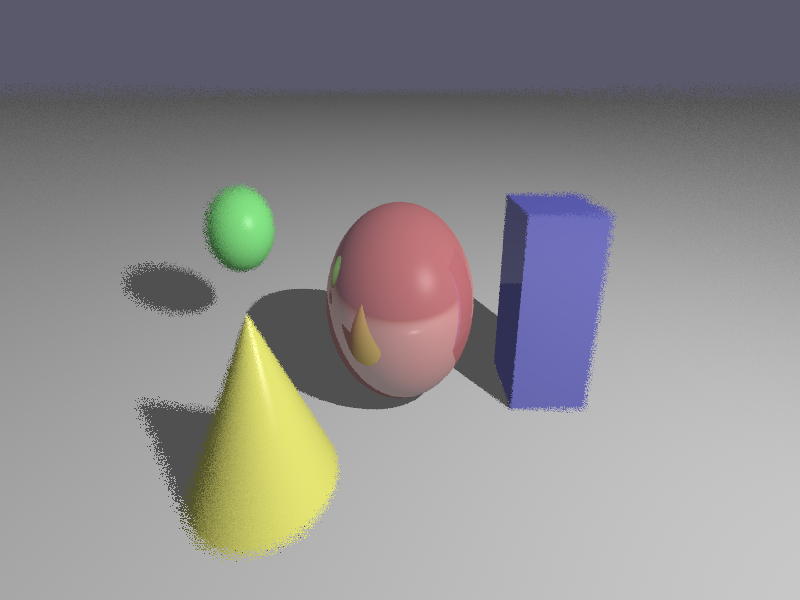

# Raytracer z Renderowaniem Dołkowym

Raytracer napisany w Pythonie implementujący techniki renderowania fovealnego w celu symulacji ludzkiej percepcji wzrokowej. Renderer stosuje zmienne częstotliwości próbkowania i efekty rozmycia w zależności od odległości od zdefiniowanego punktu ogniskowania, optymalizując wydajność przy jednoczesnym zachowaniu jakości wizualnej tam, gdzie jest to najważniejsze.

## Funkcjonalności

- **Renderowanie Fovealne**: Zmienna jakość renderowania w zależności od odległości od punktu ogniskowania
- **Wiele Prymitywów Geometrycznych**: Obsługa sfer, płaszczyzn, prostopadłościanów i stożków
- **Zaawansowane Oświetlenie**: Model oświetlenia Phonga z komponentami ambient, diffuse i specular
- **Cienie Raytraced**: Realistyczne renderowanie cieni
- **Odbicia**: Konfigurowalna odbiciowość materiałów z rekurencyjnym śledzeniem promieni
- **Variable Rate Shading**: Dynamiczne dostosowanie liczby promieni na piksel w zależności od odległości od centrum fovea
- **Rozmycie Stochastyczne**: Progresywny efekt rozmycia symulujący widzenie peryferyjne
- **Interfejs GUI**: Przyjazny interfejs użytkownika oparty na Tkinter do łatwej konfiguracji parametrów

## Implementacja Techniczna

### Algorytm Renderowania Fovealnego

Renderer dzieli obszar renderowania na trzy strefy:

1. **Strefa Wewnętrzna** (0-20% wymiaru ekranu): Pełna ostrość z maksymalną liczbą promieni na piksel
2. **Strefa Przejściowa** (20-60% wymiaru ekranu): Liniowa interpolacja między ostrością a rozmyciem
3. **Strefa Zewnętrzna** (>60% wymiaru ekranu): Minimalna jakość z pojedynczym promieniem na piksel i maksymalnym rozmyciem

### Optymalizacje Wydajności

- Adaptacyjne próbkowanie promieni: Redukuje obciążenie obliczeniowe w obszarach peryferyjnych
- Jittering stochastyczny: Tworzy naturalny efekt rozmycia bez przetwarzania końcowego
- Konfigurowalne parametry jakości: Równowaga między wydajnością a wiernością wizualną

## Wymagania

```
numpy>=1.24
Pillow>=9.5
```

Zalecany Python 3.8 lub nowszy.

## Instalacja

1. Sklonuj repozytorium lub pobierz pliki źródłowe

```bash
git clone https://github.com/KarolZebala/trak-foveated-rendering.git
```

## Użytkowanie

### Tryb GUI

Uruchom aplikację z interfejsem graficznym:

```bash
python main.py
```

GUI pozwala na konfigurację:
- Ścieżki do pliku sceny (format JSON)
- Ścieżki do pliku wyjściowego
- Wymiarów obrazu (szerokość i wysokość)
- Liczby promieni na piksel (ustawienie jakości)
- Współrzędnych centrum fovea (X, Y w pikselach)

### Tryb Linii Komend

Uruchom raytracer bezpośrednio z linii komend:

```bash
python scene_loader.py --scene scene.json --output output.png --width 800 --height 600 --rays 4 --fovea_x 400 --fovea_y 300
```

#### Argumenty Linii Komend

- `--scene`: Ścieżka do pliku JSON sceny (wymagane)
- `--output`: Ścieżka do pliku wyjściowego (wymagane)
- `--width`: Szerokość obrazu w pikselach (domyślnie: 800)
- `--height`: Wysokość obrazu w pikselach (domyślnie: 600)
- `--rays`: Liczba promieni na piksel w obszarach wysokiej jakości (domyślnie: 4)
- `--fovea_x`: Współrzędna X centrum fovea w pikselach (domyślnie: 400)
- `--fovea_y`: Współrzędna Y centrum fovea w pikselach (domyślnie: 300)

## Format Pliku Sceny

Sceny są definiowane w formacie JSON. Przykładowa struktura:

```json
{
  "camera": {
    "position": {"x": 0, "y": 2, "z": 5},
    "look_at": {"x": 0, "y": 0, "z": 0},
    "up": {"x": 0, "y": 1, "z": 0},
    "fov": 60,
    "aspect_ratio": 1.777777
  },
  "objects": [
    {
      "type": "sphere",
      "center": {"x": 0, "y": 0, "z": 0},
      "radius": 1.0,
      "material": {
        "color": {"x": 1, "y": 0.3, "z": 0.3},
        "ambient": 0.1,
        "diffuse": 0.7,
        "specular": 0.2,
        "shininess": 32.0,
        "reflectivity": 0.3
      }
    }
  ],
  "lights": [
    {
      "position": {"x": 5, "y": 5, "z": 5},
      "intensity": 1.0
    }
  ],
  "background_color": {"x": 0.1, "y": 0.1, "z": 0.15}
}
```

### Obsługiwane Typy Obiektów

- **Sphere (Sfera)**: Definiowana przez punkt środka i promień
- **Plane (Płaszczyzna)**: Definiowana przez punkt na płaszczyźnie i wektor normalny
- **Box (Prostopadłościan)**: Definiowany przez punkty minimalny i maksymalny narożnika
- **Cone (Stożek)**: Definiowany przez punkt środka, promień i wysokość

### Właściwości Materiału

- `color`: Wartości RGB (zakres 0-1)
- `ambient`: Współczynnik oświetlenia otoczenia (domyślnie: 0.1)
- `diffuse`: Współczynnik odbicia rozproszonego (domyślnie: 0.7)
- `specular`: Współczynnik odbicia zwierciadlanego (domyślnie: 0.2)
- `shininess`: Wykładnik połysku (domyślnie: 32.0)
- `reflectivity`: Współczynnik odbicia dla rekurencyjnego raytracingu (domyślnie: 0.0)

## Uwagi dotyczące Wydajności

- Wyższe wartości `--rays` zwiększają jakość, ale znacząco wpływają na czas renderowania
- Pozycja fovea wpływa na całkowity czas renderowania (umiejscowienie w centrum zazwyczaj najszybsze)
- Rozdzielczość obrazu ma kwadratowy wpływ na czas renderowania
- Materiały odbijające zwiększają koszt obliczeniowy ze względu na rekurencyjne śledzenie promieni

## Przykładowy Wynik

